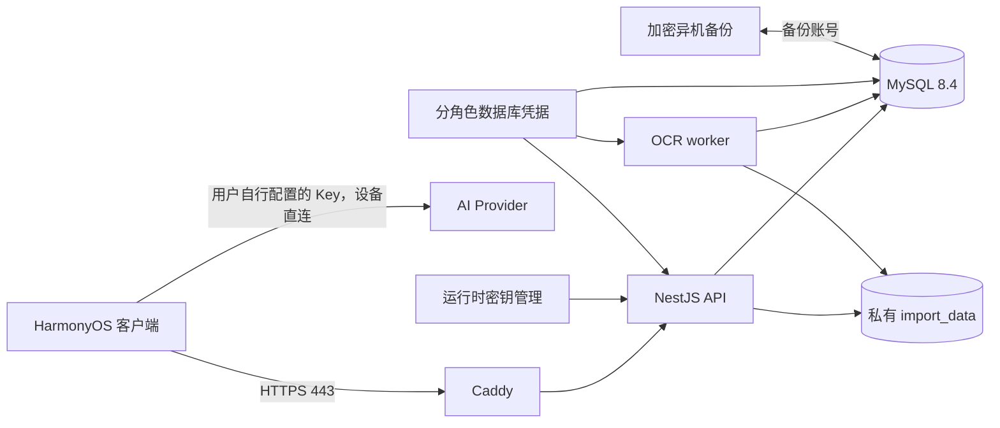

# 云端部署与数据边界

日期：2026-09-12

适用仓库：`G:\code\openHarmony\wrong_question_collection`

适用对象：开发、运维、发布和安全审查人员

## 1. 目的

本文明确整个项目中哪些代码、配置和数据需要进入云端，哪些内容只能保留在客户端或受控发布环境，哪些内容需要在云端运行但不得写入源码仓库或容器镜像。

这里的“云端”需要按职责分开理解：

1. **Git 源码仓库**：保存可审查的源代码、锁文件、测试和公开的部署定义。
2. **CI 临时工作区**：检出源码、运行测试和构建制品；任务结束后清理。
3. **CI Secret/HSM 或签名服务**：保存构建签名私钥、签名密码、AppGallery 发布凭据和构建阶段需要的秘密。
4. **私有镜像库与制品库**：保存经过扫描的服务镜像、签名后的 HAP 和可追溯构建产物。
5. **生产服务器或容器平台**：运行 API、数据库迁移、反向代理和 OCR worker，并提供运行时配置。
6. **云端持久存储与备份库**：保存 MySQL 数据、受控临时导入文件和加密备份。
7. **客户端发布渠道**：向用户分发签名后的 HAP/AppGallery 版本，不属于 API 服务器。

不能把“需要在服务器运行”理解为“可以提交到 Git”或“可以打进镜像”。生产密钥、数据库数据、证书私钥和用户文件必须通过受控的运行时挂载或云服务提供。

## 2. 当前架构和信任边界

生产网络边界：

- 公网只开放 Caddy 的 `443`。
- API 的 `3000` 只在 Docker 内部网络暴露。
- MySQL 不向公网开放。
- OCR worker 没有 HTTP 端口，只连接 MySQL 和共享导入卷。
- `worker_backend` 保持内部网络；worker 不应访问公网，也不应获得 JWT、华为账号或备份密钥。
- 客户端 AI Provider 请求由设备直连。用户填写的 AI Key 保存在设备 HUKS 边界内，不经过本项目服务器。

## 3. 必须部署到云端的内容

### 3.1 API 服务

以下内容属于 API 镜像的构建输入：

| 内容 | 路径 | 用途 |
|---|---|---|
| API 源码 | `server/src/**` | 认证、同步、题库、错题、审核记录、云端导入和健康检查 |
| 依赖清单 | `server/package.json`、`server/package-lock.json` | 可重复安装 Node.js 生产依赖 |
| TypeScript 构建配置 | `server/tsconfig.json`、`server/tsconfig.build.json` | 构建 `dist/` |
| API 镜像定义 | `server/Dockerfile` | 多阶段构建；生产镜像只保留生产依赖和编译后的 `dist/` |
| 数据库迁移 | `server/src/database/migrations/*.ts` | 创建和升级生产表结构 |

推荐由 CI 构建、扫描并发布不可变镜像，生产服务器只拉取经过验证的镜像。若暂时在服务器本机构建，只传输 `server/` 的受控构建上下文，不需要复制整个 HarmonyOS 工程。

### 3.2 生产编排和反向代理

完整自建部署需要：

| 内容 | 路径 | 处理方式 |
|---|---|---|
| 服务编排 | `server/compose.yaml` | 部署 MySQL、迁移、API、Caddy、备份和 OCR worker |
| 反向代理配置 | `server/Caddyfile` | 终止 TLS、压缩、响应安全头、5 MB 非分片请求限制 |
| 数据库账号初始化 | `server/scripts/provision-db-users.sh` | 仅在 MySQL 初始化时只读挂载 |
| 备份脚本 | `server/scripts/backup.sh` | 只读挂载给备份容器 |
| 环境变量模板 | `server/.env.example` | 仅作为字段说明，不能直接作为生产配置使用 |

`server/scripts/generate-ip-certs.sh` 只用于证书初始化或测试环境，不是 API 运行时依赖。生产优先使用正式域名和受信任 CA 证书。

### 3.3 OCR worker

如果继续提供服务器端 PDF OCR 导入能力，需要部署：

- `server/worker/Dockerfile`
- `server/worker/main.py`
- `server/worker/job_store.py`
- `server/worker/import_writer.py`
- `server/worker/errors.py`
- `server/worker/pdf_pipeline.py`
- `server/worker/question_parser.py`
- 当前流水线实际引用的 `math_layout.py`、`text_layer.py` 和相关运行时代码
- `server/worker/download_models.py`
- `server/worker/requirements.txt`

worker 镜像构建阶段需要联网下载并固化 PaddleOCR 模型；生产运行阶段不应联网下载模型。`requirements.in`、`requirements-dev.*`、`tests/`、`pytest.ini` 和 `README.md` 可进入源码仓库及 CI，但不属于生产运行时镜像。

当前 `server/worker/Dockerfile` 使用 `COPY . .`，会把 worker 构建上下文内的测试和文档一起复制到运行镜像。正式发布前应增加 `server/worker/.dockerignore` 或改为逐项 `COPY`，让生产镜像只包含上面的运行时文件。

不能在仍对外提供云端导入 API 时单独停掉 worker；否则任务可能停留在排队状态。如果产品确认只保留当前客户端 AI PDF 流程，应先明确关闭或移除云端导入入口，再从部署中移除 worker 和对应临时存储。

### 3.4 云端数据库

MySQL 需要持久化以下业务类别：

- 用户和加密后的华为身份映射：`users`、`huawei_identities`。
- 设备和会话：`devices`、`sessions`。刷新令牌只保存哈希，不保存原文。
- 题库、题目、错题和复习记录：`question_banks`、`questions`、`wrong_questions`、`review_records`。
- 幂等同步操作：`sync_operations`。
- 云端导入任务、租约、分片、草稿、产物、确认和清理检查点：`import_jobs`、`import_job_leases`、`import_upload_parts`、`import_draft_questions`、`import_artifacts`、`import_confirmations`、`import_confirmed_questions`、`import_cleanup_checkpoints`。

数据库必须使用持久卷或托管 MySQL，字符集保持 `utf8mb4`，时区按 UTC 处理，`synchronize` 保持关闭，表结构只通过迁移任务更新。

数据库账号继续分离：

- migration 账号：只供迁移容器使用。
- runtime 账号：API 和 worker 使用的最小运行权限。
- backup 账号：只供备份容器使用。
- root 账号：仅初始化和受控运维使用，不能交给 API 或 worker。

### 3.5 云端文件和持久卷

| 数据 | 当前位置 | 是否持久化 | 要求 |
|---|---|---|---|
| MySQL 数据 | `mysql_data` | 是 | 私有持久卷或托管数据库，不打进镜像 |
| PDF 导入临时文件与产物 | `import_data`，容器内 `/work/imports` | 是，按任务生命周期清理 | API 与 worker 共享；禁止公网目录映射；需要容量和剩余空间告警 |
| Caddy 状态 | `caddy_data`、`caddy_config` | 是 | 私有卷 |
| 数据库备份 | 当前 compose 映射 `server/backup` | 是 | 生产应加密并复制到独立账号、独立主机或对象存储，不能只留在同一服务器 |

云端 PDF 文件和题目图片只属于服务器 OCR 流程的临时产物，必须遵守任务状态、确认和 TTL 清理规则。不能把 `import_data` 当永久用户文件盘，也不能绕过清理清单直接批量删除。

`import_data` 默认不纳入整卷快照、常规主机备份或数据库备份，因为它包含可重新上传的敏感临时文件，而且备份副本会绕过现有 TTL 清理。若灾难恢复明确要求保留这类文件，必须使用独立加密备份、短保留期和受限账号，并让取消、确认和过期清理同步覆盖所有备份副本。

## 4. 必须在云端配置、但禁止进入源码和镜像的内容

当前 API 和 worker 直接读取环境变量，不支持从 `*_FILE` 或 `/run/secrets/*` 读取秘密文件。现阶段应使用云平台 Secret 管理器将值映射为进程环境变量，或使用部署主机上权限受限的 `.env`。只有生产代码增加秘密文件读取支持后，才能直接使用 Docker secret 文件挂载。以下值不得提交到 Git、写入 Markdown、复制到镜像层、打印到日志或发送给客户端：

| 配置 | 使用方 | 要求 |
|---|---|---|
| `MYSQL_ROOT_PASSWORD` | MySQL 初始化 | 与其他账号密码不同，至少 32 个随机字符 |
| `DB_MIGRATION_PASSWORD` | migrate | 独立迁移凭据 |
| `DB_RUNTIME_PASSWORD` | API、worker | 最小权限运行凭据 |
| `DB_BACKUP_PASSWORD` | backup | 只读备份凭据 |
| `JWT_ACCESS_SECRET` | API | 至少 32 字符 |
| `JWT_REFRESH_SECRET` | API | 至少 32 字符，不能与 access secret 相同 |
| `DATA_ENCRYPTION_KEY` | API | 正好 64 个十六进制字符；用于身份数据保护 |
| `HUAWEI_CLIENT_ID` | API | 生产应用对应值 |
| `HUAWEI_CLIENT_SECRET` | API | 服务器专用，绝不能进入 HAP |
| TLS 私钥 | Caddy | 只读挂载；权限最小化；不进入 Git 或镜像 |

非秘密但必须按环境配置的内容包括 `SERVER_IP` 或正式域名、端口、数据库地址、数据库名、华为 HTTPS 端点、导入存储根目录、PDF 大小/分片限制、产物 TTL 和最小剩余空间。

生产 `.env` 可以存在于部署主机，但必须满足：

- 不进入源码仓库和构建上下文。
- 仅部署账号可读。
- 不随普通日志、工单或聊天附件传播。
- 轮换后同步更新运行服务，并保留回滚方案。
- `.env.example` 只放占位符，不能复制任何真实值。

`DATA_ENCRYPTION_KEY` 丢失后，现有加密身份数据将无法正常使用；必须由 Secret 管理系统持久保存并纳入受控恢复流程。更换加密密钥需要显式的数据迁移方案。轮换 JWT secret 会使现有会话失效，应按发布窗口执行。

已有 MySQL 持久卷创建后，修改 `.env` 不会重新执行初始化脚本，也不会自动修改数据库账号密码。轮换数据库密码时，应先由受控管理员执行对应的 `ALTER USER`，再以可回滚方式同步更新 API、worker、migration 和 backup 的运行时 Secret，重启受影响服务并验证连接。不能只修改 `.env` 后重启容器。

## 5. 不应放到 API 服务器的项目内容

### 5.1 HarmonyOS 客户端工程

以下内容用于客户端开发和发布，不属于 API 服务器运行时：

- `entry/**`
- `AppScope/**`
- `oh-package.json5`、`oh-package-lock.json5`
- `build-profile.json5`
- `hvigor/**`、`hvigorfile.ts`
- 客户端测试、预览截图和 DevEco 工程配置

签名后的 HAP 应发布到 AppGallery、企业应用分发系统或受控制品仓库。不要把 HAP 放在 API 容器、MySQL 数据卷或导入存储中。只有明确建设独立下载站时，才应把 HAP 放入专用制品存储和 CDN。

生产 HAP 的签名私钥、签名密码和 AppGallery 发布凭据只能进入 CI Secret/HSM、专用签名服务或发布平台的秘密存储。它们不得进入 Git、CI 工作区文件、构建镜像、API 主机、HAP 包本身或普通制品仓库。

### 5.2 客户端秘密和设备私有数据

以下内容必须留在设备或客户端安全边界，不能上传到本项目服务器：

- 用户配置的 OpenAI、DeepSeek、Claude、Gemini 或其他 AI Provider API Key。
- HUKS 密钥材料、HUKS alias 对应的密文和任何可还原密钥的数据。
- AI 设置页输入框中的临时 Key。
- 客户端 AI 请求的完整授权头。
- 设备本地的题目证据图片和图片生命周期清理记录。
- 当前客户端 AI PDF 流程选择的原始 PDF、页面位图和裁剪中间文件。
- 本地数据库、preferences、缓存目录和调试日志。

当前同步载荷只发送题库名、学科、题目类型、题干、选项、答案、解析、错题状态和关联 UUID，不发送 `imagePath`、二进制图片或 PixelMap。

### 5.3 JSON 导入原文件

用户选择的 JSON 文件在客户端读取和解析。服务器接收的是验证后的题库及题目同步操作，不需要保存原始 JSON 文件。

因此：

- `JSON_BANK_EXAMPLE` 只属于客户端界面说明。
- 不需要为示例新增服务器接口、模板表或对象存储文件。
- 服务器数据库保存解析后的题库文本数据，不保存用户选择的原始 `.json` 文件。
- 不应把用户 JSON 原文写入请求日志、错误日志或备份之外的临时目录。

### 5.4 本地开发、缓存和生成物

以下内容不能上传到生产服务器或生产镜像：

- 根目录和 `server/` 下的 `.env` 真值文件。
- `local-signing.json`、`local.properties`、本地签名证书和签名私钥。
- `server/certs/server.key` 及其他 TLS 私钥；它们只能通过受控挂载提供。
- `node_modules/`、`oh_modules/`。
- `server/dist/` 本地构建副本；应由受控构建阶段重新生成。若使用经过签名或校验的预构建制品，必须保留来源和哈希。
- `build/`、`.hvigor/`、`.cxx/`、coverage、pytest/Jest 缓存、临时测试目录。
- `server/backup/` 中的本地备份文件。
- `.git/`、IDE 设置、个人脚本、截图和调试转储。
- `docs/superpowers/plans/ui-review-2026-09-12/` 等审查证据图片。
- 真实用户数据制作的测试夹具。

## 6. Git、CI、制品库和生产环境的区别

| 内容 | Git | CI 工作区 | CI Secret/HSM | 镜像/制品库 | 部署主机/平台 | 持久卷/备份库 |
|---|---:|---:|---:|---:|---:|---:|
| `server/src/**` 与锁文件 | 是 | 是 | 否 | API 镜像内为生产依赖和 `dist/` | 仅本机构建时需要源码 | 否 |
| 数据库迁移源码 | 是 | 是 | 否 | migrate 镜像 | 仅本机构建时需要源码 | 否 |
| API/worker 测试和开发依赖 | 是 | 是 | 否 | 否 | 否 | 否 |
| worker 运行代码和锁定依赖 | 是 | 是 | 否 | worker 镜像 | 仅本机构建时需要源码 | 否 |
| `compose.yaml`、`Caddyfile`、必要运维脚本 | 是 | 是 | 否 | 否 | 是，受控部署配置 | 否 |
| `.env.example` | 是 | 可作字段校验 | 否 | 否 | 可作字段参考 | 否 |
| 真实 `.env`/运行时 Secrets | 否 | 只按最小范围临时注入 | 是 | 否 | 是，平台注入或受限文件 | 否 |
| TLS 公钥证书/CA 链 | 可保存公开部分 | 可校验 | 否 | 可放受控制品库 | 是，只读挂载 | 否 |
| TLS 私钥 | 否 | 否 | 是或专用证书服务 | 否 | 是，受限挂载或平台托管 | 否 |
| MySQL 与 Caddy 数据 | 否 | 否 | 否 | 否 | 仅挂载点 | 是，私有持久卷 |
| `import_data` 临时文件 | 否 | 否 | 否 | 否 | 仅挂载点 | 是，私有卷且通常不备份 |
| 数据库备份 | 否 | 否 | 仅保存备份密钥 | 否 | 可有加密短期副本 | 是，加密且隔离保存 |
| HarmonyOS 源码 | 是 | 是 | 否 | 否 | API 主机不需要 | 否 |
| 签名后的 HAP | 否 | 构建后短暂存在 | 否 | 是，受控制品库/AppGallery | API 主机不需要 | 否 |
| HAP 签名私钥、密码、发布凭据 | 否 | 仅由签名步骤短时使用 | 是 | 否 | API 主机不需要 | 否 |

## 7. 数据是否上云的业务清单

### 7.1 应当上云

- 登录账户与设备绑定所需的最小身份数据；华为标识按现有加密/哈希设计保存。
- 刷新会话的哈希、有效期、撤销和轮换状态。
- 题库名称、学科和题库 UUID。
- 题目类型、题干、选项、答案、解析和题目 UUID。
- 错题待掌握/已掌握状态及关联题目 UUID。
- 复习记录和同步幂等操作。
- 服务器 OCR 流程启用时的任务元数据、临时上传分片、草稿、临时产物与清理检查点。

### 7.2 不应上云

- 用户 AI Provider Key 和任何可恢复该 Key 的材料。
- 当前客户端 AI PDF 流程的原始 PDF、整页图、题目证据图和本地路径。
- 原始 JSON 文件；只同步解析后的合法字段。
- 与业务无关的通讯录、照片库、剪贴板、设备文件列表等数据。
- 调试 token、完整 Authorization 请求头、数据库密码、华为 client secret。
- 不受 TTL/会话所有权约束的临时文件。

### 7.3 条件上云

| 数据 | 条件 | 边界 |
|---|---|---|
| 原始 PDF | 只有服务器 OCR 导入流程明确启用且用户主动选择上传时 | 私有 `import_data`；分片校验；按任务取消、确认和 TTL 清理 |
| OCR 题目图片 | 只有服务器 OCR 流程生成时 | 私有 `import_data`；受 artifact manifest 与清理检查点管理 |
| 数据库备份 | 生产恢复要求 | 加密、独立账号、异机保存、定期恢复演练 |
| 运行日志 | 故障诊断和审计 | 结构化、限期保留；脱敏；不含 token、Key、PDF/JSON 正文 |
| HAP | 应用发布 | AppGallery/专用制品库；不放 API 服务器 |

## 8. 推荐发布流程

1. 在干净的 CI 工作区检出仓库，确认目标提交和依赖锁文件。
2. 运行 API、迁移和 worker 测试；不要使用生产数据库或真实用户文件做测试。
3. 使用锁定到 digest 的可信基础镜像构建 API 和 worker 镜像，生成 SBOM，记录产物 digest，并执行依赖和镜像漏洞扫描。
4. 将镜像推送到私有镜像仓库。
5. 在部署平台配置数据库、持久卷、内部网络、TLS 和 Secret；不复制开发机 `.env`。
6. 先备份数据库并验证备份可读取。
7. 使用 migration 账号单独执行迁移；API 的 `DB_RUN_MIGRATIONS` 保持 `false`。
8. 启动 API、Caddy、备份任务和需要的 worker。
9. 验证 `/health/ready`、TLS 证书链、数据库连通性、同步推送/拉取和日志脱敏。
10. 用测试账号做一次题库 JSON 导入；确认服务器只出现题库/题目操作，没有原始 JSON 文件。
11. 若启用服务器 OCR，再用非敏感小型 PDF 验证上传、处理、审核、确认和过期清理。
12. 发布客户端前核对 `entry/src/main/ets/constants/ApiConfig.ets` 和受信任 CA 资源与生产域名/证书一致。

## 9. 上线前检查表

### 代码与镜像

- [ ] 生产版本来自明确提交和不可变镜像 digest。
- [ ] Node、Python、MySQL 和 Caddy 基础镜像已锁定 digest，并通过受控流程定期更新。
- [ ] API 和 worker 镜像已有 SBOM、漏洞扫描记录和来源证明。
- [ ] API 镜像只含 production dependencies 和 `dist/`。
- [ ] worker 镜像不含测试、文档、缓存和开发依赖。
- [ ] 未把整个 HarmonyOS 工程复制到 API 主机。
- [ ] 未把本地 `dist/`、`node_modules/` 或构建缓存直接上传。

### 密钥与访问控制

- [ ] Git 历史和镜像层不含 `.env`、证书私钥、数据库密码或签名材料。
- [ ] JWT access/refresh secret 不同且已安全生成。
- [ ] `DATA_ENCRYPTION_KEY` 为独立的 64 位十六进制密钥。
- [ ] migration、runtime、backup、root 数据库账号分离。
- [ ] 现有数据库密码轮换包含 `ALTER USER`、Secret 原子更新、连接验证和回滚步骤。
- [ ] worker 只获得 runtime 数据库凭据和导入卷权限。
- [ ] AI Provider Key 只在设备 HUKS 中，API/worker/数据库/日志均不可见。
- [ ] HAP 签名私钥、签名密码和发布凭据只在 CI Secret/HSM 或签名服务中。

### 网络与存储

- [ ] 公网只开放 443；3000 和 3306 未对公网开放。
- [ ] worker 网络保持 internal，无公共端口和外网出口。
- [ ] MySQL、`import_data`、Caddy 状态均使用持久卷。
- [ ] `import_data` 不被静态服务器或 Caddy 暴露。
- [ ] `import_data` 已排除在常规整卷快照和备份之外；例外副本已加密、短期保留并纳入清理。
- [ ] 备份已加密并复制到独立故障域。
- [ ] 临时 PDF/产物的 TTL、磁盘余量和清理失败有监控。

### 数据和日志

- [ ] 同步载荷不含设备图片、本地路径、PixelMap 或 AI Key。
- [ ] JSON 导入不保存原始文件，只保存解析后的题库字段。
- [ ] 日志不记录 Authorization、refresh token、华为 access token、AI Key、完整 PDF/JSON 内容。
- [ ] 数据库备份与恢复演练覆盖用户、题库、同步和导入表。
- [ ] 删除、取消、确认和过期清理仍遵守既有幂等及所有权边界。

## 10. 当前仓库需要注意的部署事项

1. 根 `.gitignore` 已排除 `server/.env`、`server/certs/`、`server/backup/`、依赖目录和构建目录，部署时仍需检查 Git 历史与镜像层，不能只依赖 ignore。
2. 当前客户端 API 地址位于 `entry/src/main/ets/constants/ApiConfig.ets`，发布环境必须与 Caddy 证书和网络信任配置一致。
3. 当前 Caddy 使用 `server/certs/server.crt` 与 `server/certs/server.key` 的文件挂载。证书是运行依赖，私钥不是源码或镜像内容。
4. 当前 `server/scripts/backup.sh` 生成的是未加密 `.sql` 文件，并由 compose 写入 `server/backup`。生产必须限制目录权限、增加备份加密和异机副本，避免明文泄露或服务器与备份同时丢失。
5. 当前 worker Dockerfile 会复制整个 worker 上下文。应在正式镜像发布前收紧构建上下文。
6. 当前正式客户端 PDF 入口使用设备端 AI 流程；服务器 OCR 代码仍保留。部署团队必须明确是否继续对外提供服务器 OCR 能力，避免部署一个无人消费或无法处理的半启用流程。
7. `CloudCutoverContracts` 的 server 脏树守卫当前可能因已有 server 修改而失败。不得通过删除、回退或清理 server 工作树来制造通过；发布应基于审查后的明确提交和干净 CI 工作区。
8. 当前 Dockerfile/compose 使用 `node:22-alpine`、`python:3.11-slim`、`mysql:8.4` 和 `caddy:2-alpine` 等可变标签。正式发布应锁定镜像 digest，生成 SBOM，并通过受控升级流程更新基础镜像。

## 11. 旧云端 OCR 导入的退役方案

当前客户端的正式 PDF 入口已经进入设备端 AI 识别流程，但旧云端 OCR 链路尚未完全移除。客户端仍保留云端导入页面、服务、数据模型和审核适配器；服务端仍加载导入模块、开放导入接口，并在 compose 中运行 OCR worker。因此可以删除旧功能，但必须按完整业务链退役，不能只删除 worker 或隐藏一个入口。

### 11.1 可以删除的客户端内容

确认不再支持服务器 OCR 后，可以删除或收敛以下内容：

| 内容 | 准确路径 | 处理方式 |
|---|---|---|
| 云端 PDF 设置页 | `entry/src/main/ets/pages/PdfImportSetupPage.ets` | 删除页面及其路由注册 |
| 云端 PDF 进度页 | `entry/src/main/ets/pages/PdfImportProgressPage.ets` | 删除上传、轮询、取消和错误恢复界面 |
| 云端导入服务 | `entry/src/main/ets/services/CloudImportService.ets` | 删除分片上传、查询、确认、下载和确认回执逻辑 |
| 云端导入 HTTP 封装 | `entry/src/main/ets/services/CloudImportApi.ets` | 删除旧导入 API 请求与响应解析 |
| 云端导入模型 | `entry/src/main/ets/models/CloudImportModels.ets` | 删除旧任务、草稿、产物和确认模型 |
| 云端审核适配器 | `entry/src/main/ets/services/review/CloudPdfReviewAdapter.ets` | 删除云端审核分支 |
| 云端状态组件 | `entry/src/main/ets/components/CloudImportStatusCard.ets` | 无其他引用后删除 |
| 云端流程状态 | `entry/src/main/ets/utils/PdfImportState.ets` | 只删除 `Cloud*` 状态、任务和产物字段，保留设备端 AI 审核所需状态 |
| 旧页面注册 | `entry/src/main/resources/base/profile/main_pages.json`、`entry/src/main/resources/base/profile/easy_go.json` | 删除 `PdfImportSetupPage` 和 `PdfImportProgressPage` 路由 |
| 审核页分流 | `entry/src/main/ets/pages/PdfImportReviewPage.ets` | 移除 `CloudPdfReviewAdapter` 条件分支，继续使用设备端 `AiPdfReviewAdapter` |

必须保留 `entry/src/main/ets/pages/PdfAiImportSetupPage.ets`、`entry/src/main/ets/pages/PdfAiImportProgressPage.ets`、`entry/src/main/ets/services/ai/PdfAiImportCoordinator.ets` 和设备端审核流程。这些是当前客户端 AI 导入能力，不属于旧服务器 OCR。

### 11.2 可以删除的服务端内容

客户端兼容期结束且存量任务清理完成后，可以删除：

- `server/src/imports/**` 中的控制器、服务、仓储、存储、清理、上传准入、DTO、合同及对应测试。
- `server/src/app.module.ts` 中的 `ImportsModule` 引入和注册。
- `server/src/main.ts` 中只服务 `/v1/imports/pdf/**` 的原始分片请求解析、确认请求限制和启动期导入清理连接。
- `server/worker/**` 整个 OCR worker 工程及其测试和镜像定义。
- `server/compose.yaml` 中的 `ocr-worker` 服务、API/worker 的 `import_data` 挂载和只服务旧导入链路的 `IMPORT_*`、`WQC_OCR_*` 配置。
- `.env.example`、部署文档和监控中只服务旧导入链路的配置、告警与健康检查。
- 无其他服务使用后，compose 顶层的 `import_data` 卷声明。

账号登录、设备会话、题库、题目、错题、复习记录、同步幂等、HUKS 和 AI Key 安全边界与旧 OCR 无关，必须保留。删除旧导入功能不得弱化这些模块的认证、所有权检查或同步幂等保护。

### 11.3 数据库和文件清理原则

已经在任何环境执行过的迁移文件不能删除、重写或改名，包括：

- `server/src/database/migrations/1788000000000-cloud-import-schema.ts`
- `server/src/database/migrations/1788000001000-import-job-leases.ts`
- `server/src/database/migrations/1788000002000-import-confirmations.ts`

退役时应新增一条正向迁移删除不再使用的 `import_*` 表。执行该迁移前必须确认：

- 没有 `uploading`、`queued`、`processing` 或 `review` 状态的存量任务。
- 不再需要恢复历史草稿、确认结果或产物审计数据。
- 旧版本客户端的兼容期已经结束，或者服务器明确返回可识别的功能下线响应。
- `import_data` 中的分片、源 PDF 和题目图片已通过原有任务所有权、确认和 TTL 清理流程处理。
- 数据库和文件清理完成后再移除清理服务，避免留下无人管理的敏感文件。

不能通过直接清空 `import_data`、手工删除部分表或修改旧迁移记录来缩短退役过程。需要保留审计记录时，应先导出最小化、加密且有保留期限的归档，再删除在线数据。

### 11.4 推荐下线顺序

1. 冻结旧云端 OCR 功能，不再增加新能力，并统计仍在使用旧导入接口的客户端版本和存量任务。
2. 发布只使用设备端 AI 导入的新客户端，移除所有进入旧云端页面的入口；为旧客户端保留明确的兼容期。
3. 等待存量任务完成或取消，执行既有确认、产物回执和 TTL 清理，确认 `import_data` 没有遗留业务文件。
4. 移除客户端的云端页面、服务、模型、状态和审核分支，并完成 ArkTS 逐文件检查和客户端合同测试。
5. 从服务端移除导入路由、模块和 worker，再从 compose 移除 worker、导入卷挂载及相关环境变量。
6. 新增并执行正向数据库迁移，删除不再使用的 `import_*` 表；验证账号、同步、题库和错题接口没有回归。
7. 删除不再使用的导入卷、监控、备份例外和运行权限，更新架构文档、部署清单和灾难恢复流程。

退役完成后，服务器只承担账号、会话、题库、题目、错题、复习记录和同步等业务。PDF 读取、页面图片、AI 请求和 AI Key 继续留在设备端；服务器只接收用户最终保存并参与同步的题库数据。

### 11.5 退役验收

- [ ] `ImportBankPage` 只进入 `PdfAiImportSetupPage`，不存在旧云端导入入口。
- [ ] 页面注册表中不存在 `PdfImportSetupPage` 和 `PdfImportProgressPage`。
- [ ] 客户端不再引用 `CloudImportService`、`CloudImportApi`、`CloudImportModels` 或 `CloudPdfReviewAdapter`。
- [ ] API 不再注册 `/v1/imports/pdf/**` 路由，也不再加载 `ImportsModule`。
- [ ] compose 不再创建 `ocr-worker` 或 `import_data`。
- [ ] 生产数据库没有未完成导入任务，目标 `import_*` 表已通过新迁移安全删除。
- [ ] 账号登录、token 轮换、题库同步、错题同步和复习记录同步测试通过。
- [ ] 设备端 AI PDF 设置、进度、审核、保存和临时图片清理测试通过。
- [ ] 全量客户端 CJS 测试、服务端测试、ArkTS 逐文件检查和 `git diff --check` 通过。

## 12. 一句话判断规则

- **业务服务代码、迁移和运行依赖**：进入源码仓库和受控构建，最终进入对应云端镜像。
- **真实密钥、证书私钥和数据库凭据**：只在云端运行时注入，不进入 Git、文档或镜像。
- **数据库、临时导入文件和备份**：进入私有持久存储，不进入镜像或源码仓库。
- **HarmonyOS 客户端、HAP 和签名材料**：进入客户端发布流程，不进入 API 服务器。
- **AI Key、HUKS 数据、设备证据图、当前客户端 AI PDF 原文件**：只留在设备，绝不进入本项目云端。
- **原始 JSON 文件**：客户端解析，不上传；服务器只接收验证后的题库和题目同步数据。
